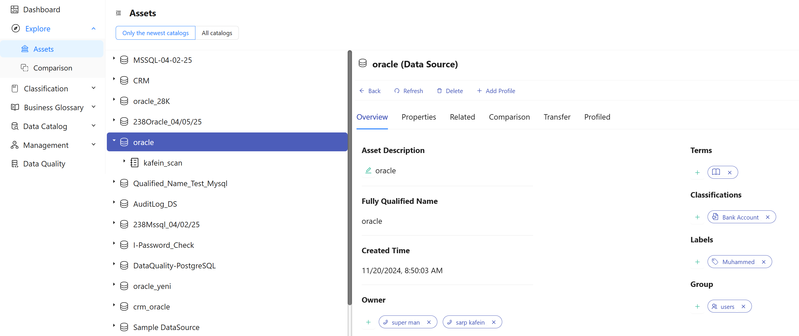
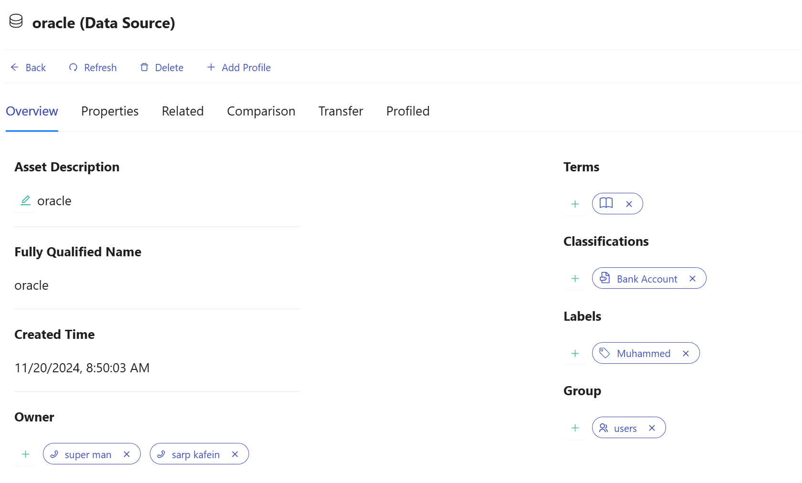
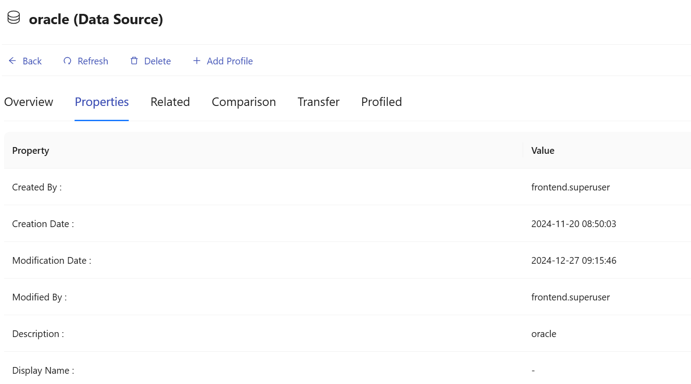
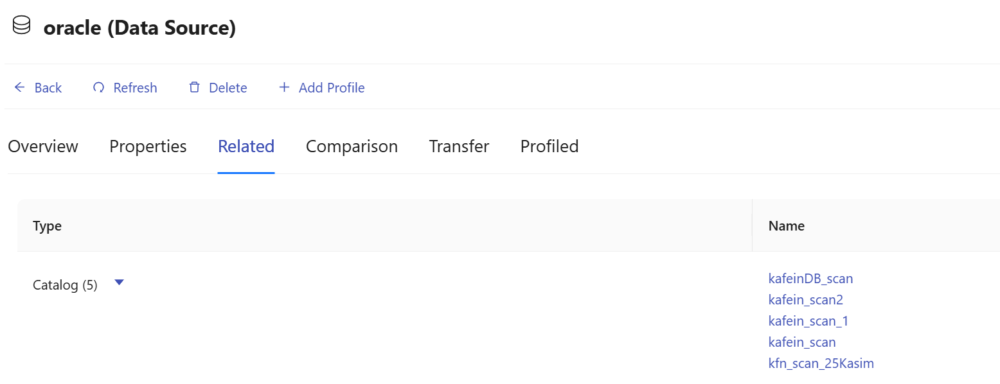
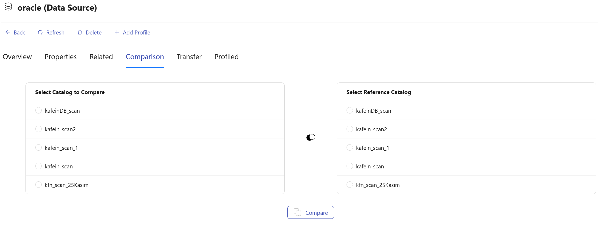
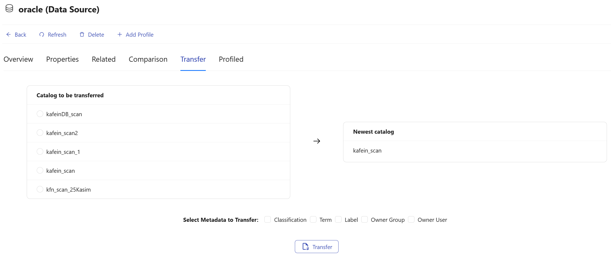
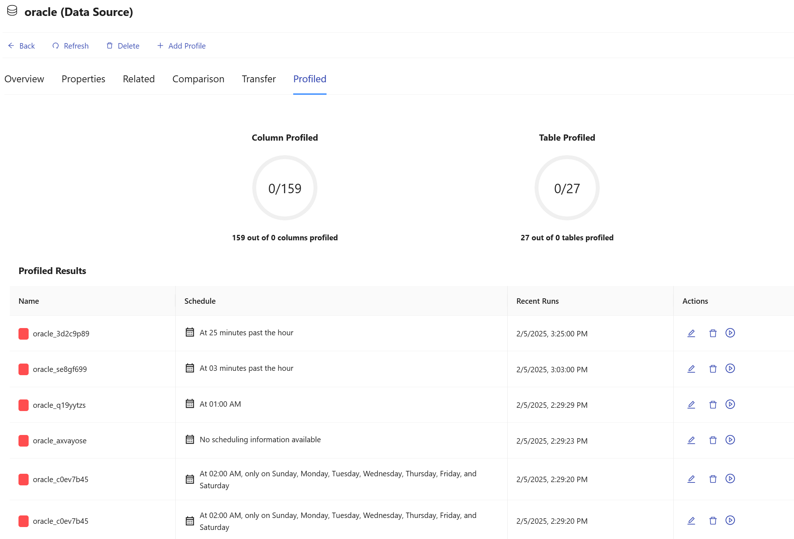

Users can reach all cataloged assets as a list by clicking the **Assets** from **Explore** on the menu.
## Assets
In the Assets list, all data sources, catalogs, schemas and tables are comprehensively displayed. 

* By clicking on the **Only the newest catalogs**, users can access the newest ones. 
* By clicking on the arrow to the left of any data source, users can access the catalogs it contains. 
* By clicking on the arrow to the left of any catalog, users can access the schemas it contains. 
* By clicking on the arrow to the left of any schema, users can access the tables it contains.

### Data Sources

   icon indicates **Data Source**. Data Source details include **Overview, Properties, Related, Comparison, Transfer** and **Profiled** tabs.

* **Refresh**: It is used to refresh the field.
* **Delete**: It is used to delete the selected asset.
* **+ Add Profile**: It is used to add a profile to the selected asset.

#### Overview Tab

 It shows the general information about the asset as **Description, Fully Qualified Name, Created Time, Owner, Terms, Classifications, Labels**, and **Group**. 

 

#### Properties Tab

 

#### Related Tab

 

#### Comparison Tab

#### Transfer Tab

#### Profiled Tab

 

{ .lightbox data-group="gallery" } 
{ .lightbox data-group="gallery" }
{ .lightbox data-group="gallery" }
{ .lightbox data-group="gallery" }
{ .lightbox data-group="gallery" }
